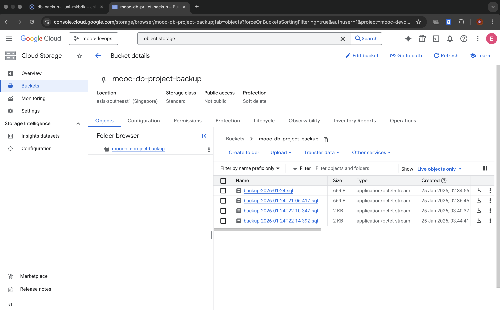

# Exercise 3.10: The Project Step 18 - Backup CronJob

This directory contains the solution for Exercise 3.10.

## Overview
A functional CronJob has been implemented in Kubernetes to backup the PostgreSQL database to a Google Cloud Storage bucket every 24 hours.

## Deployment Strategy
- **Secret Management**: The Google Cloud service account key is securely injected during the deployment pipeline (GitHub Actions) into a Kubernetes Secret.
- **CronJob**: Runs a `gcloud` container that dumps the database using `pg_dump` and uploads it to GCS using `gsutil`.

## Verification Evidence

### 1. CronJob in Google Cloud Console
The CronJob is successfully deployed and visible in the GKE workloads.

### 2. Backups in Cloud Storage
The backups are successfully created and stored in the Google Cloud Storage bucket.

