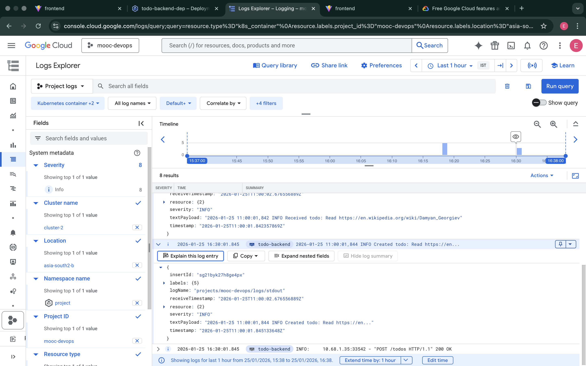

# Exercise 3.12: The Project Step 20 - GKE Monitoring and Logging

This directory contains the solution for Exercise 3.12.

## Overview
Google Kubernetes Engine (GKE) provides integrated monitoring and logging capabilities. For this step, we leveraged GKE's native logging infrastructure to capture application logs.

## Implementation
- **GKE Logging**: Enabled by default in the GKE cluster configuration.
- **Application Logs**: The Todo application (frontend and backend) writes logs to `stdout` and `stderr`, which are automatically captured by Cloud Logging.

## Verification Evidence

### Log Explorer Screenshot
The following screenshot from Google Cloud Console's Log Explorer shows the logs generated when a new todo item is created. It confirms that the application logs are correctly ingested and searchable.

