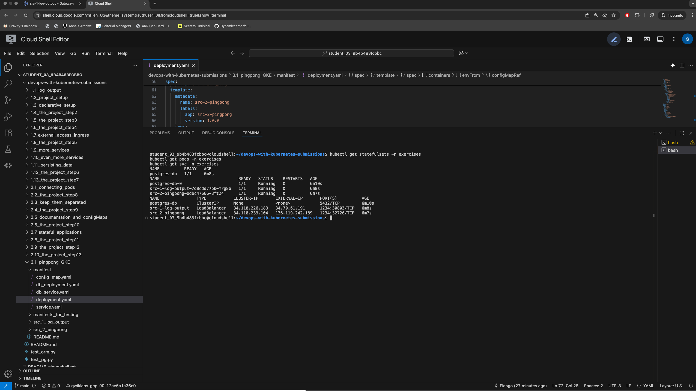
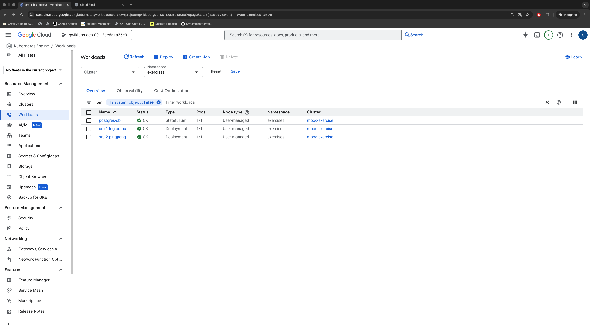
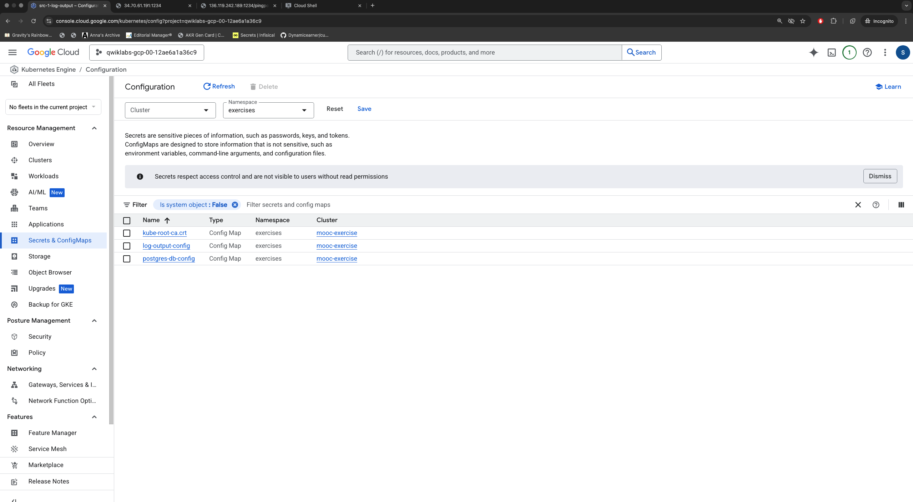
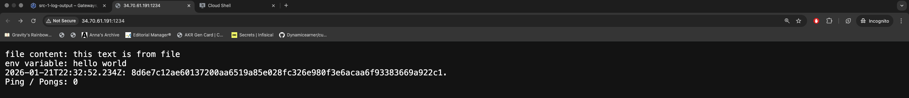
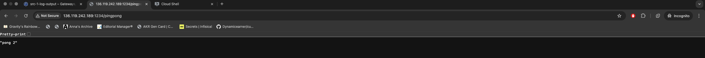

## 3.1 Pingpong GKE

Run a Postgres database as a StatefulSet and persist Ping-pong application counters.

### Usage

**1. Prerequisite: Google Kubernetes Engine (GKE)**
Ensure you are connected to your GKE cluster via **Google Cloud Shell**.
```bash
gcloud container clusters get-credentials <YOUR_CLUSTER_NAME> --zone <YOUR_ZONE> --project <YOUR_PROJECT_ID>
```

**2. Create Namespace**
```bash
kubectl create namespace exercises
```

**3. Deploy App**
The application uses the following pre-built images hosted on Docker Hub:

| Component | Image Tag |
| :--- | :--- |
| **Log Output (Main App)** | `elango5292/src-1-log-output:v2` |
| **Ping-pong (Counter)** | `elango5292/src-2-pingpong:v2` |

```bash
kubectl apply -f ./3.1_pingpong_GKE/manifest/
```

**4. Verify**
```bash
kubectl get statefulsets -n exercises
kubectl get pods -n exercises
kubectl get svc -n exercises
```

**5. Test Database Connectivity (Optional)**
To expose the Postgres database externally for testing purposes:

```bash
kubectl apply -f ./3.1_pingpong_GKE/manifests_for_testing/db_external.yaml
kubectl get svc -n exercises postgres-db-external
```

### 6. Services & Access

| Service | Type | Purpose | Access Command |
| :--- | :--- | :--- | :--- |
| `src-1-log-output` | LoadBalancer | Main Application | `kubectl get svc -n exercises src-1-log-output` |
| `src-2-pingpong` | LoadBalancer | Counter Service | `kubectl get svc -n exercises src-2-pingpong` |
| `postgres-db-external` | LoadBalancer | **Testing Only** | `kubectl get svc -n exercises postgres-db-external` |

**Database Note:** The application uses `psycopg[binary]` and `sqlalchemy` for PostgreSQL connections.

---

### 7. Evidence

**1. Cluster Status (Terminal)**
*Showing StatefulSet, Pods, and Services with External IPs.*

<br/>

**2. GKE Workloads (Console)**
*Verification of Pods running in Google Cloud Console.*

<br/>

**3. ConfigMaps (Console)**
*Verification of Configuration Maps.*

<br/>

**4. Application Access (LoadBalancer)**
*Log Output Service (Main App):*

<br/>

*Ping-pong Service (Counter):*

<br/>


