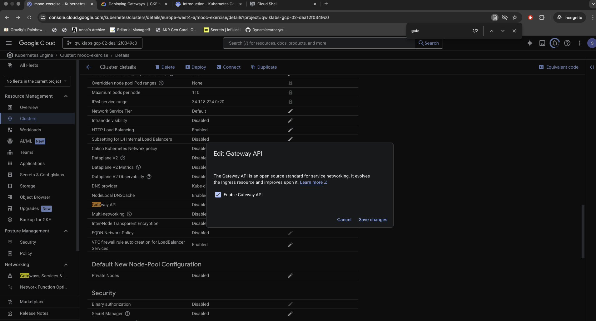
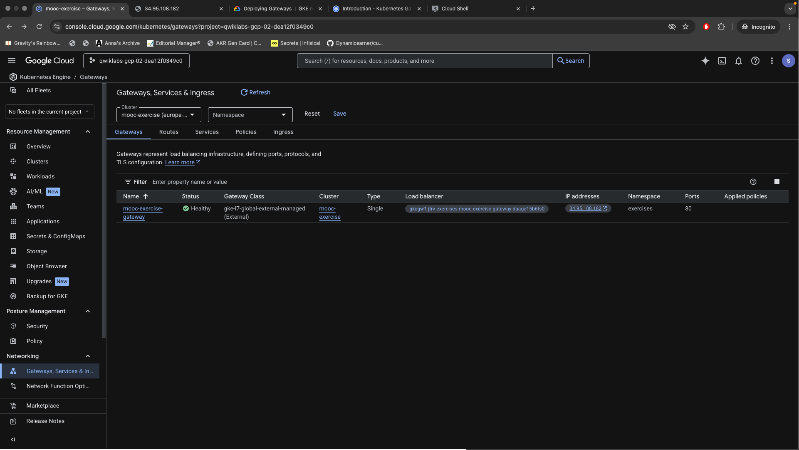
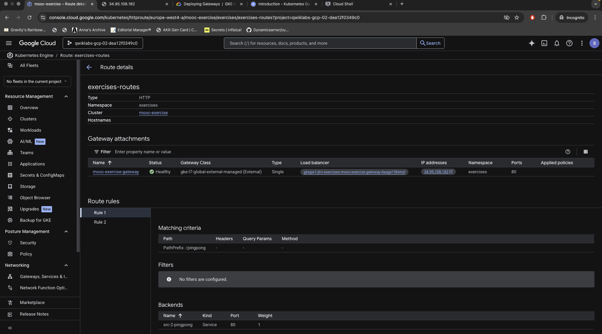
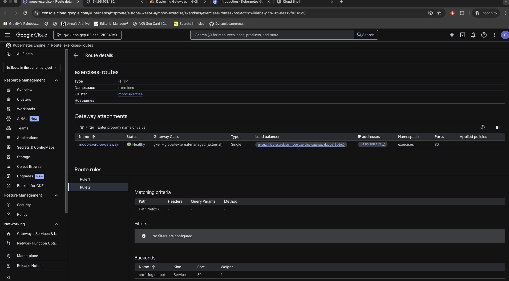
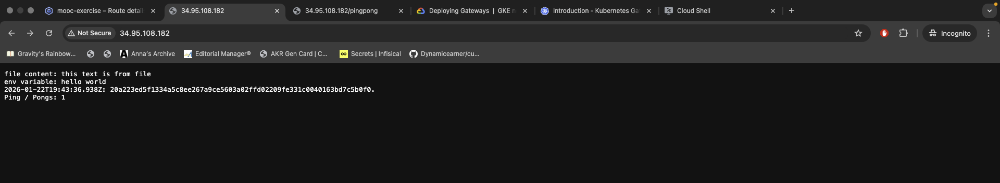
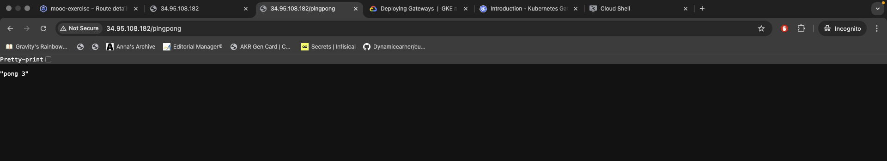

# 3.3 To the Gateway

Migration of the "Log output" and "Ping-pong" applications to use the **Kubernetes Gateway API** on GKE.

### Prerequisites
1. **GKE Cluster** with **Gateway API** enabled (Standard mode).
   > *Note: I enabled this via the Google Cloud Console UI.*

   

### Deployment
Deploy the application and the Gateway resources:
```bash
kubectl create namespace exercises
kubectl apply -f manifest/
```

### Verification
Check the Gateway and Routes:
```bash
kubectl get gateway -n exercises
kubectl get httproute -n exercises
kubectl get svc -n exercises
```

### Evidence

**1. Gateway Resources (Terminal)**


**2. HTTP Routes Configuration**
*Route for Ping Pong:*


*Route for Log Output:*


**3. Browser Verification**
*Accessing Log Output (/):*


*Accessing Ping Pong (/pingpong):*

