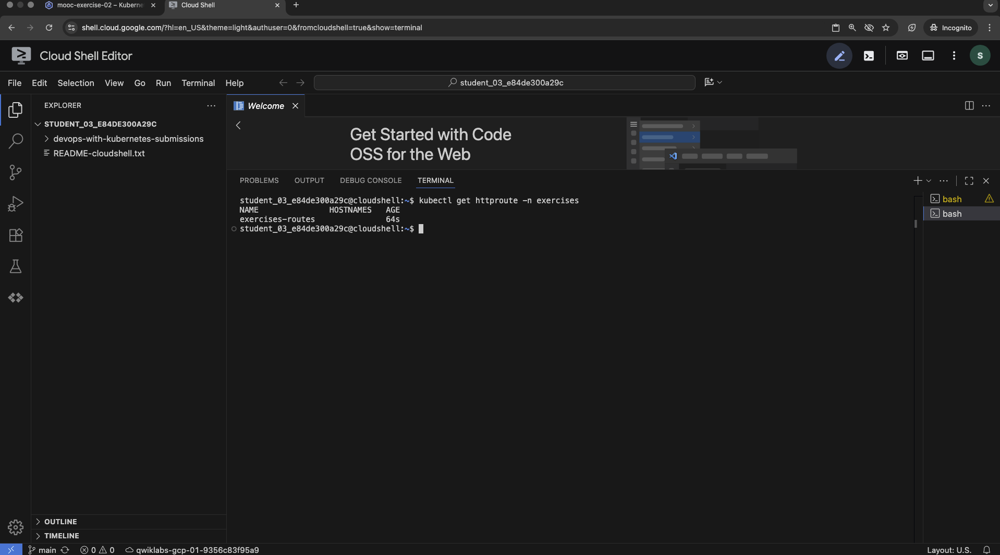
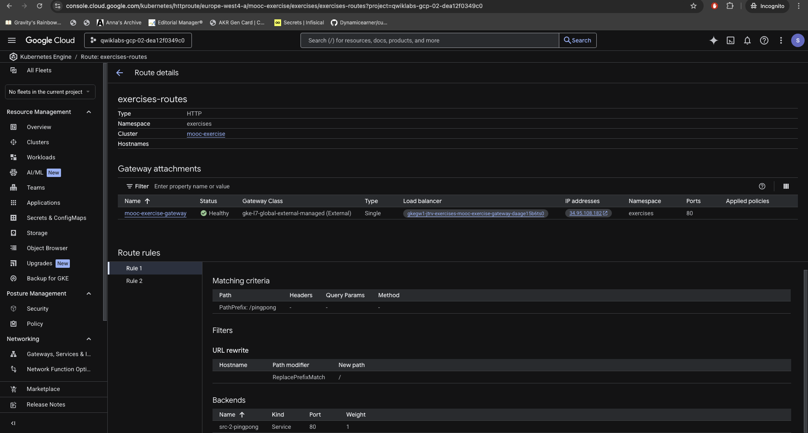

# 3.4 Rewritten routing
Use the Gateway API to rewrite specific request paths (e.g., `/pingpong`) to the root `/` before routing to the application, allowing the service to respond at its root logic.

### Prerequisites
1. **GKE Cluster** with **Gateway API** enabled (Standard mode).

### Image Updated
The Ping-pong application has been updated to **v5**.
- `elango5292/src-2-pingpong:v5` (Built for linux/amd64)
- Adds a new endpoint: `/version` which returns `{"version": "v5"}`.
- Roots handler `/` is now used for the main functionality, expecting the Gateway to strip prefixes.

### Deployment
Apply all manifests:
```bash
kubectl apply -f manifest/
```

### Verification
**1. Routes**
- URL: `http://<GATEWAY_IP>/` -> Routes to **Log Output**
- URL: `http://<GATEWAY_IP>/pingpong` -> Rewrites to `/` -> Routes to **Ping Pong**

**2. Check Version**
Check the new version endpoint to confirm deployment:
```bash
curl http://<GATEWAY_IP>/pingpong/version
# Output: {"version": "v5"}
```

**3. Gateway Configuration**
Ensure the Gateway and Routes are correctly established:
```bash
kubectl get httproute -n exercises
```
*Verify that the `URLRewrite` filter is applied.*

### Evidence

**1. Deployment & Verification (Terminal)**
*Applying manifests and checking HTTP Routes:*



**2. Gateway Rule Configuration (Console)**
*Verification of the URL Rewrite rule for `/pingpong` -> `/`*


**3. Application Verification**
*Accessing `/pingpong` (Shows count):*


*Accessing `/pingpong/version` (Shows v5):*

