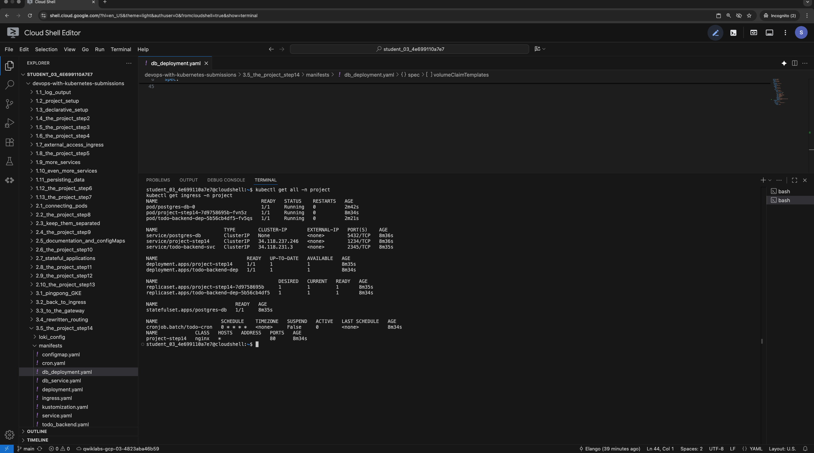
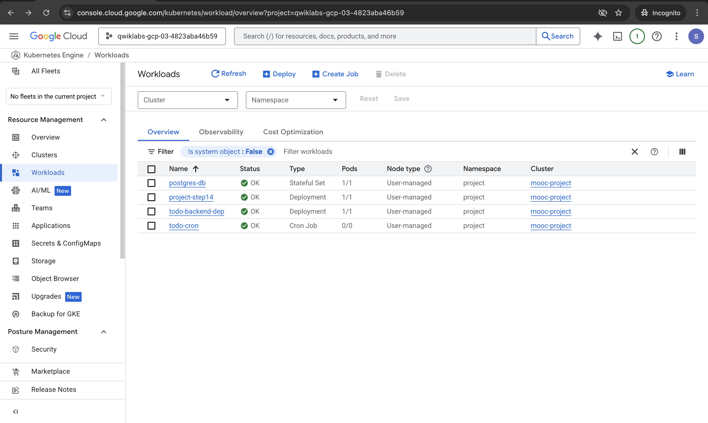

# Exercise 3.5: The Project Step 14 - Kustomize

## Goal
Configure the project to use **Kustomize** for configuration management and deploy it to **Google Kubernetes Engine (GKE)**.

## Changes
- **Directory**: `3.5_the_project_step14`
- **Kustomize**: Added `kustomization.yaml` in `manifests/` to manage resources and image tags.
- **Images**: Updated to use placeholder names which are replaced by Kustomize with specific tags.

## 1. Quick Start

### Prerequisites
- GKE Cluster running and `kubectl` configured.
- Namespace `project` created.

### Deploy
Use Kustomize to apply the manifests:
```bash
kubectl create namespace project
kubectl apply -k ./3.5_the_project_step14/manifests/
```

### Verify
Check that all pods are running (Frontend, Backend, Postgres, Cron):
```bash
kubectl get pods -n project
kubectl get ingress -n project
```

## 2. Kustomize Configuration
The `kustomization.yaml` file manages the following resources:
1. `configmap.yaml`
2. `cron.yaml`
3. `db_deployment.yaml`
4. `db_service.yaml`
5. `deployment.yaml` (Frontend)
6. `ingress.yaml`
7. `service.yaml`
8. `todo_backend.yaml`

It also performs image tag replacements for:
- `todo-backend-image` -> `elango5292/todo-project-backend:v1`
- `todo-app-image`     -> `elango5292/todo-project-app:v1`
- `todo-cron-image`    -> `elango5292/todo-project-cron:v1`

### Evidence

**1. Deployment with Kustomize**
*Applying manifests using `kubectl apply -k`:*


**2. Resource Verification (Terminal)**
*Listing all resources in the `project` namespace:*


**3. GKE Workloads (Console)**
*Verification of Workloads running in Google Cloud Console:*

