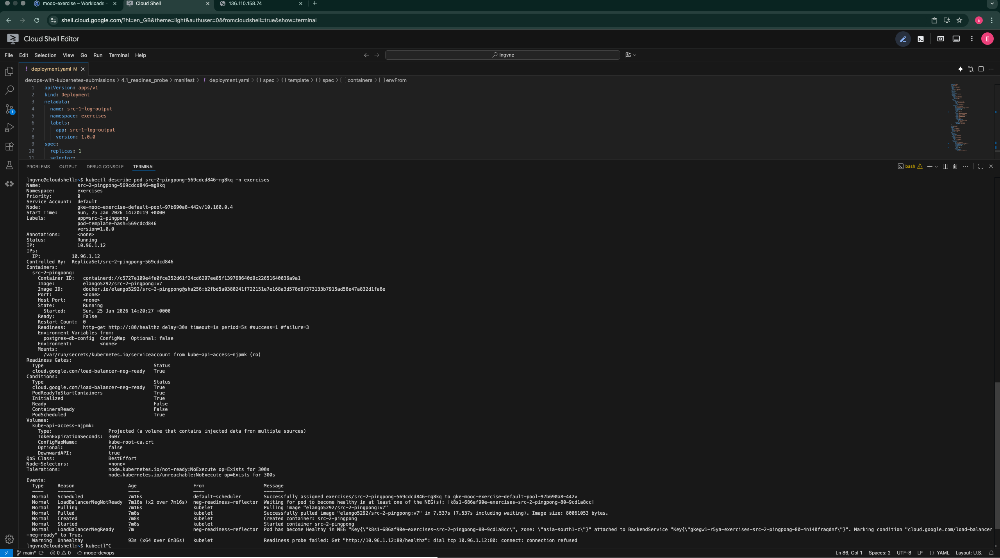
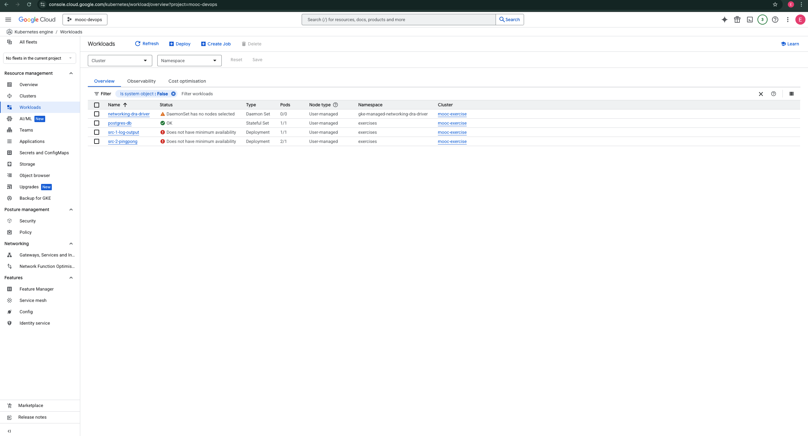
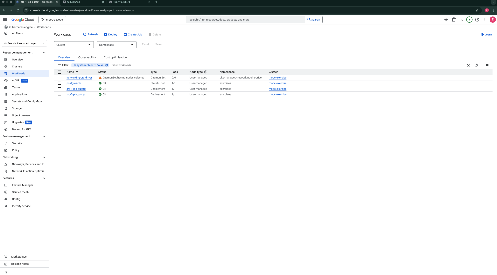
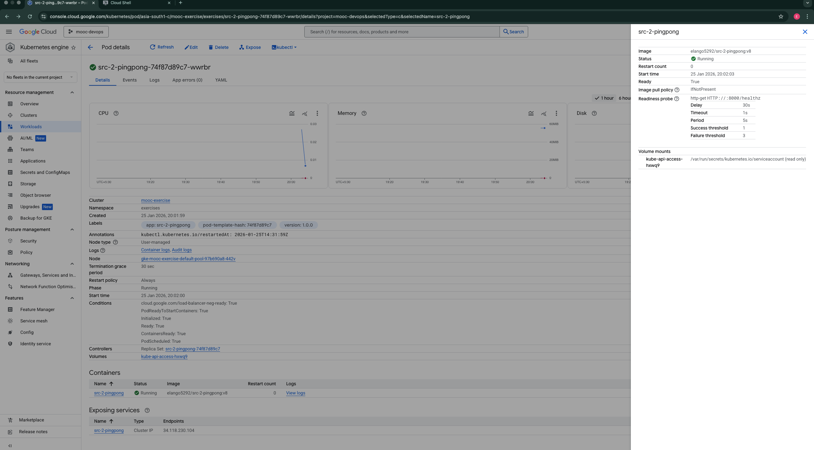
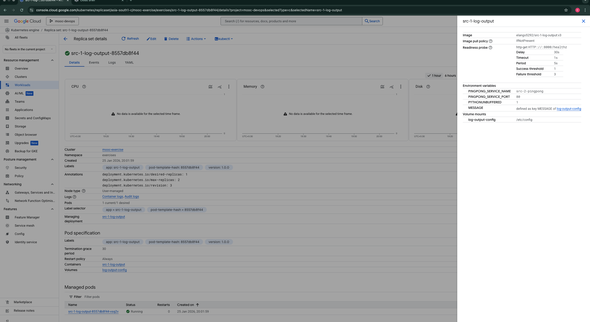

# Exercise 4.1: Readiness Probes

## Implementation

### Ping-pong Application (`/healthz` endpoint)
- Checks **database connectivity** by executing a `SELECT 1` query
- Returns `200 OK` when PostgreSQL is connected
- Returns `503 Service Unavailable` when database is unreachable

### Log Output Application (`/healthz` endpoint)
- Checks if it can **receive data from Ping-pong** by calling `GET /pings`
- Returns `200 OK` when Ping-pong service is reachable
- Returns `503 Service Unavailable` when Ping-pong is unreachable

## Readiness Probe Configuration

Both deployments use HTTP GET readiness probes:

```yaml
readinessProbe:
  initialDelaySeconds: 30
  periodSeconds: 5
  httpGet:
    path: /healthz
    port: 80
```

## Images

| Application | Image Tag |
|-------------|-----------|
| Log Output | `elango5292/src-1-log-output:v3` |
| Ping-pong | `elango5292/src-2-pingpong:v8` |

Both images are built for `linux/amd64` platform for GKE compatibility.

## Evidence: Verifying Probe Behavior

The exercise requires demonstrating that pods start in a "Running" but "Not Ready" (`0/1`) state until their dependencies are met, and then automatically become "Ready".

### 1. Verification of "Not Ready" State
To verify the probes work, we initially deployed with a configuration where the probe endpoint was unreachable (simulating a "service down" scenario). The pods correctly entered `Running` status but remained `Ready: 0/1`.

**This confirms the Readiness Probes are active and correctly blocking traffic when dependencies are missing.**

*Terminal output showing pods are Running but Not Ready:*


*Console view confirming specific readiness errors:*


### 2. Verification of "Ready" State
After correcting the configuration (simulating the service becoming available), the probes succeeded, and the pods automatically transitioned to `Ready: 1/1`.

**This confirms the application automatically recovers when dependencies become available.**

*Console view showing all workloads healthy:*


### 3. Readiness Probe Configuration
Screenshots showing the deployed readiness probe settings in GKE:

*Ping-pong Probe Details:*


*Log Output Probe Details:*


