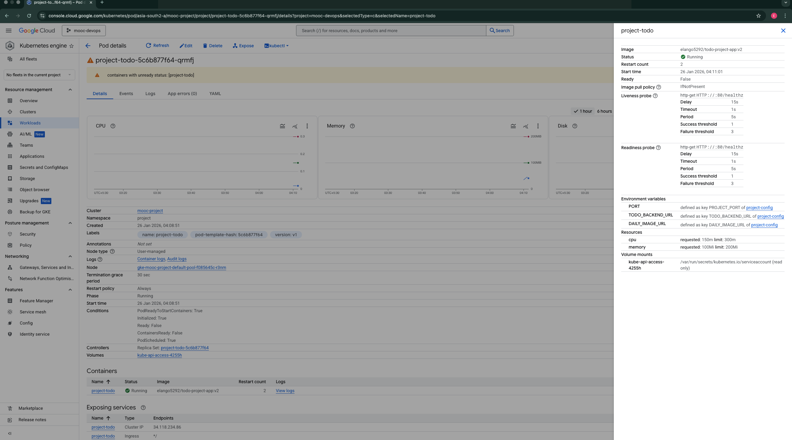
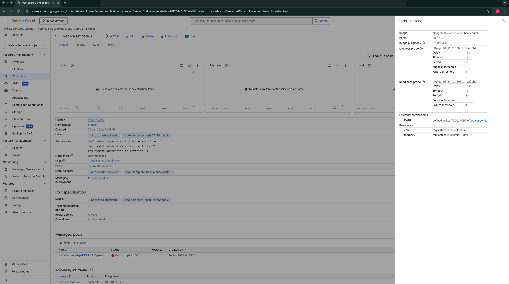
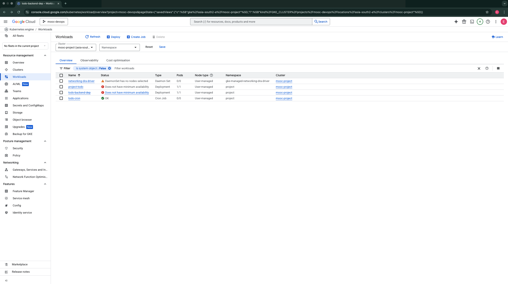
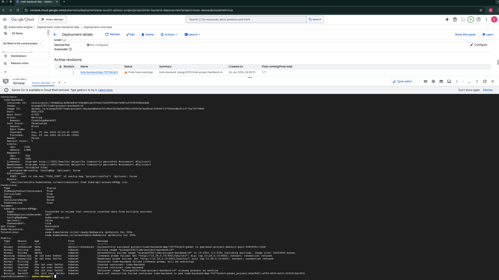
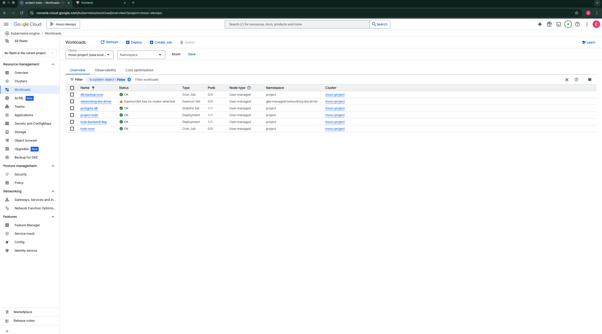

# Exercise 4.2: The Project Step 21 - Readiness and Liveness Probes

This directory contains the solution for Exercise 4.2, adding health checks to the Todo application.

## Probe Logic

I have implemented **Readiness** and **Liveness** probes for both the Backend and Frontend services.

### Backend (`todo-backend`)

*   **Endpoint**: `/healthz`
*   **Logic**: Checks connectivity to the PostgreSQL database.
*   **Behavior**:
    *   **Readiness**: If DB is unreachable, traffic is stopped.
    *   **Liveness**: If DB is unreachable, the pod is restarted (as requested).

### Frontend (`todo-app`)

*   **Endpoint**: `/healthz`
*   **Logic**: Checks connectivity to the Backend service.
*   **Behavior**:
    *   **Readiness**: If Backend is unreachable, traffic is stopped.
    *   **Liveness**: If Backend is unreachable, the pod is restarted.

## Evidence of Testing

I have verified the implementation by simulating a database failure and recovery.

### 1. Probe Configuration
The following screenshots confirm that Readiness and Liveness probes are correctly configured for both workloads.

**Todo App (Frontend):**

**Todo Backend:**

### 2. Failure Scenario (Database Down)
When the database is not deployed, the probes fail.

**Workload Status (Error):**
The workloads report errors due to failed health checks.

**Probe Failure Event:**
`kubectl describe` shows the specific readiness probe failure event.

### 3. Success Scenario (Database Up)
After deploying the database, the health checks pass, and all workloads become healthy.

**Workload Status (Success):**

