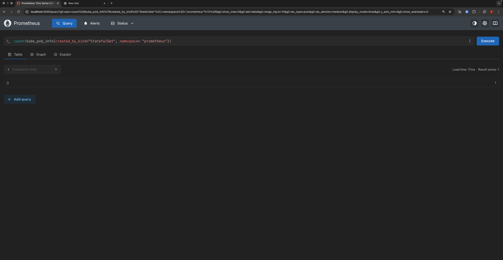
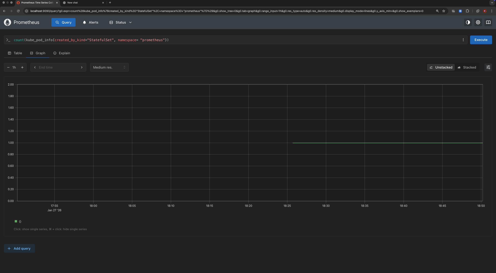

# Exercise 4.3: Prometheus

### Install Monitoring Stack

To install Prometheus using Helm:

```bash
# Add the Prometheus community helm repository
helm repo add prometheus-community https://prometheus-community.github.io/helm-charts

# Install Prometheus in the 'prometheus' namespace
helm install mooc-prometheus prometheus-community/prometheus --version 28.6.0 -n prometheus --create-namespace
```

> [!TIP]
> **Docker Desktop Note:** If the `node-exporter` pod fails with a "mount propagation" error, patch the DaemonSet to set `mountPropagation: None` for the root volume:
> ```bash
> kubectl patch daemonset mooc-prometheus-prometheus-node-exporter -n prometheus --type='json' -p='[{"op": "replace", "path": "/spec/template/spec/containers/0/volumeMounts/2/mountPropagation", "value": "None"}]'
> ```

### Exercise: StatefulSet Pod Count Query

The objective was to write a PromQL query that shows the number of pods created by StatefulSets in the `prometheus` namespace.

**Final Query:**
```promql
count(kube_pod_info{created_by_kind="StatefulSet", namespace="prometheus"})
```

### Evidence

#### Result of the Count Query


#### All Kube Pod Info for StatefulSets


#### Graph View for StatefulSet Pods

