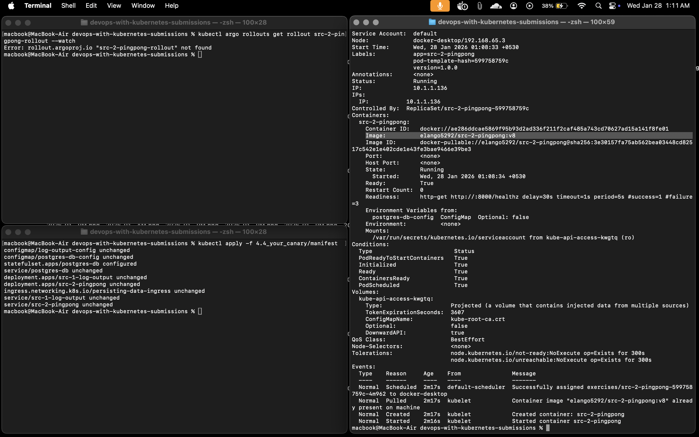
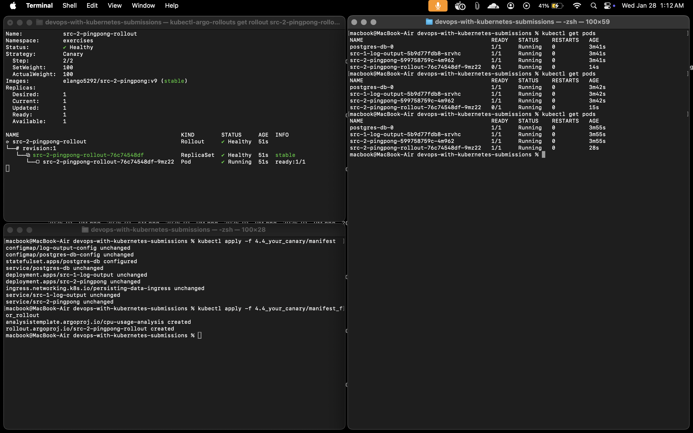

# Exercise: 4.4. Your canary

## Implementation

## File Descriptions

*   `analysis_template.yaml`: Defines the success criteria. It checks CPU usage. Threshold is set very low (`0.001`) to ensure failure for testing.
*   `rollout.yaml`: The stable deployment. Uses image `v8`.
*   `rollout_v2.yaml`: The update deployment. Uses image `v9`. This triggers the canary analysis and fails.

## Steps to Reproduce

1. **Create Base Resources**:
   ```bash
   kubectl apply -f manifest/
   ```

2. **Create Analysis Template**:
   ```bash
   kubectl apply -f manifest_for_rollout/analysis_template.yaml
   ```

3. **Deploy Initial Rollout (Stable)**:
   ```bash
   kubectl apply -f manifest_for_rollout/rollout.yaml
   ```
   *   Verifies the rollout is healthy with image `v8`.

4. **Trigger Canary Update (v2)**:
   ```bash
   kubectl apply -f manifest_for_rollout/rollout_v2.yaml
   ```
   *   Applies image `v9`.
   *   **Failure Expected**: CPU analysis threshold is exceeded, triggering an automatic rollback.

## Images

### 1. Initial Apply (Stable State)
Using `src-2-pingpong:v8` which returns `v5` at `/version`.


### 2. Rollout in Progress
Argo Rollouts managing the update.


### 3. Automated Rollback Triggered
Update to `v9` (which returns `v6` at `/version`) failed the CPU analysis.
The rollout was aborted and rolled back to the stable state.


## Image Information

| Application | Image Tag | Note |
|-------------|-----------|------|
| Log Output | `elango5292/src-1-log-output:v3` | |
| Ping-pong (Stable) | `elango5292/src-2-pingpong:v8` | `/version` returns "v5" |
| Ping-pong (Canary) | `elango5292/src-2-pingpong:v9` | `/version` returns "v6" |

Both images are built for `linux/amd64` platform.
