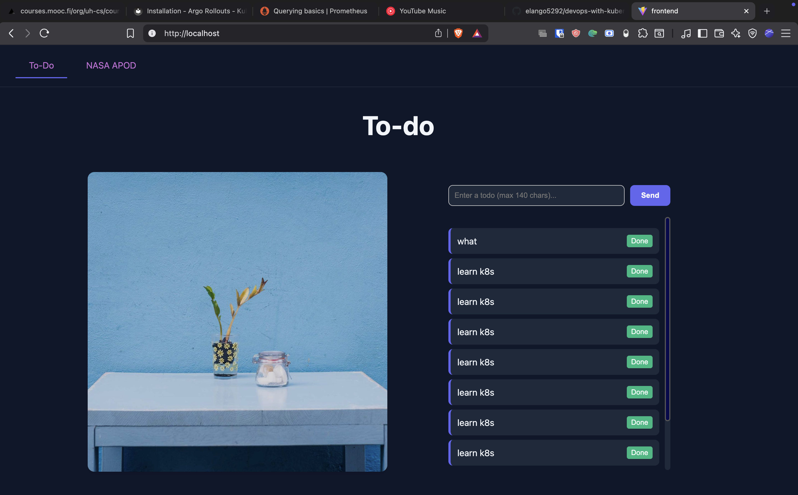
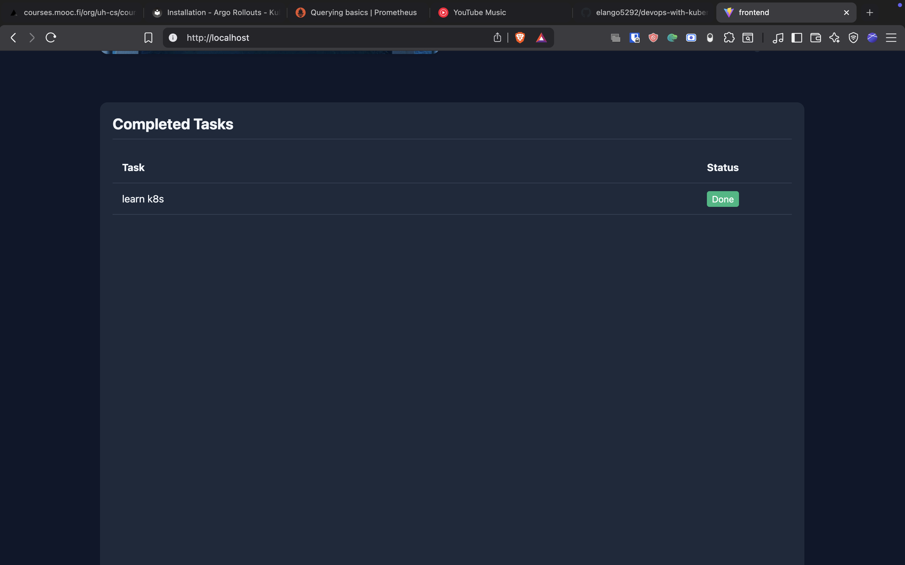

# Exercise 4.5: The Project Step 22

## Implementation

Implemented the "Mark as Done" feature for the Todo application.

### Backend Changes (`todo-backend`)
*   Updated database schema to include `done` (boolean) column.
*   Added `PUT /todos/{id}` endpoint to update the `done` status.
*   Updated `GET /todos` to return the full object (`id`, `todo`, `done`).

### Frontend Changes (`todo-app`)
*   Added a "Done" button to the todo list items.
*   Implemented `PUT` API call when the "Done" button is clicked.
*   Fixed layout overflow issue by moving the Input box outside the scrollable area.
*   Added a new "Completed Tasks" table view at the bottom of the page to display completed items.

## Evidence of Testing

### Todo List (Active Tasks and Layout Fix)

### Completed Tasks (New Feature)

