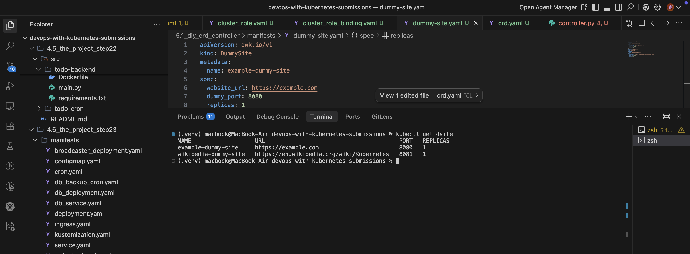
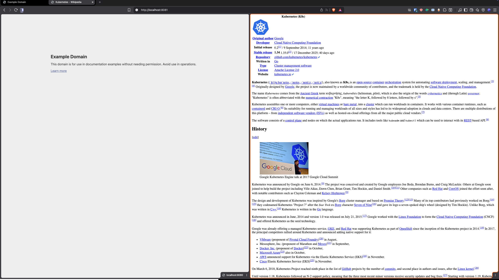
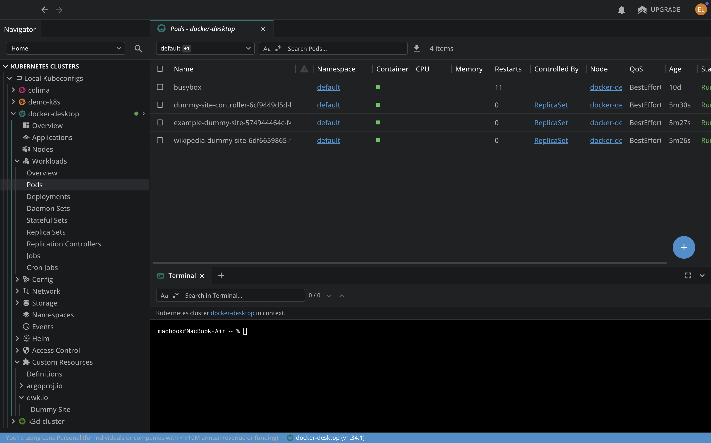
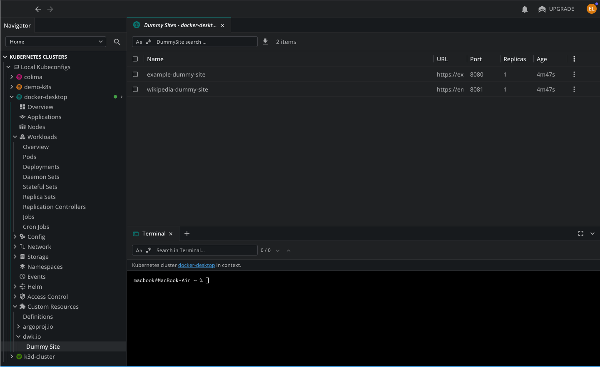

# Exercise 5.1 - DIY CRD & Controller

## Stack
- **Controller**: Python with [kopf](https://kopf.readthedocs.io/) framework
- **Image**: `elango5292/dummy-site-controller:v1`

## Features
- Custom `website_url` - fetches HTML from any URL
- Custom `dummy_port` - each site gets its own LoadBalancer port
- `replicas` support for scaling

## How It Works
1. Controller watches for `DummySite` custom resources
2. When created, it fetches HTML from `website_url`
3. Creates: ConfigMap (HTML) → Deployment (nginx) → LoadBalancer Service

## Usage
```bash
# Deploy everything (from repo root)
kubectl apply -k 5.1_diy_crd_controller/manifests/

# Check DummySites
kubectl get dsite
```

## Evidence

### kubectl get dsite


### Browser - Both Sites Running


### Lens - All Pods


### CRD Registered

