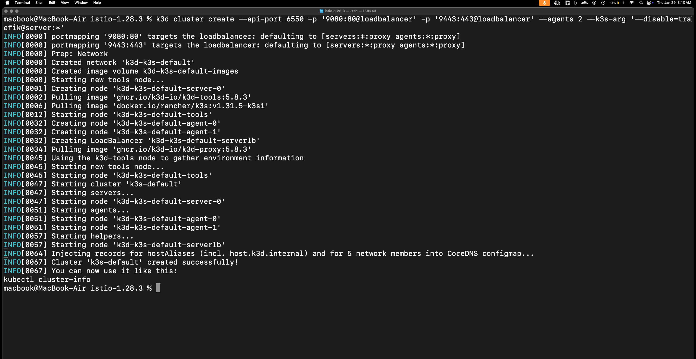
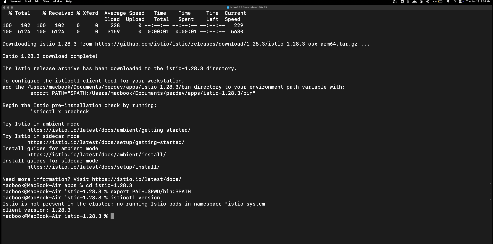
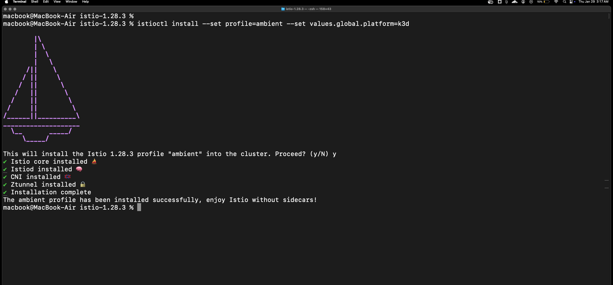
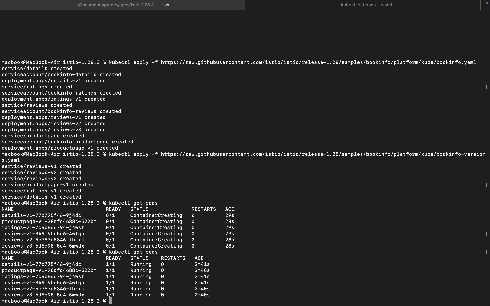
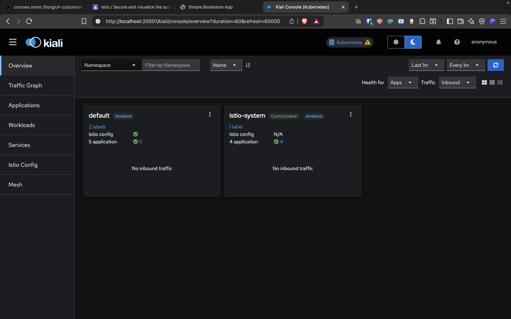
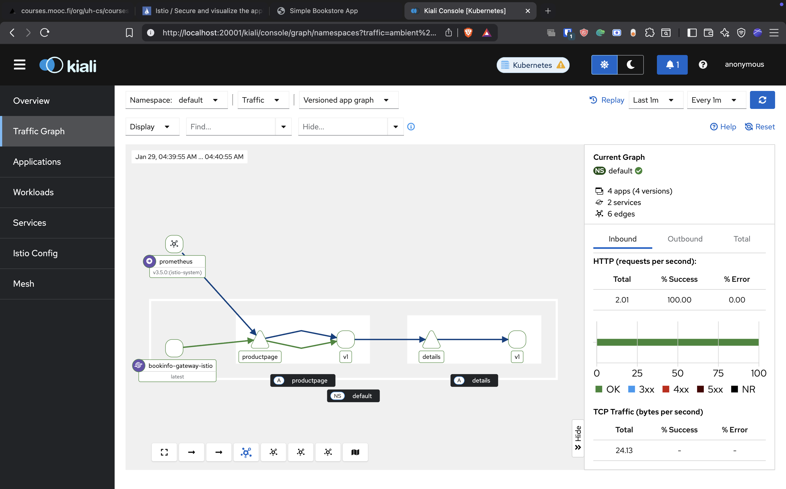
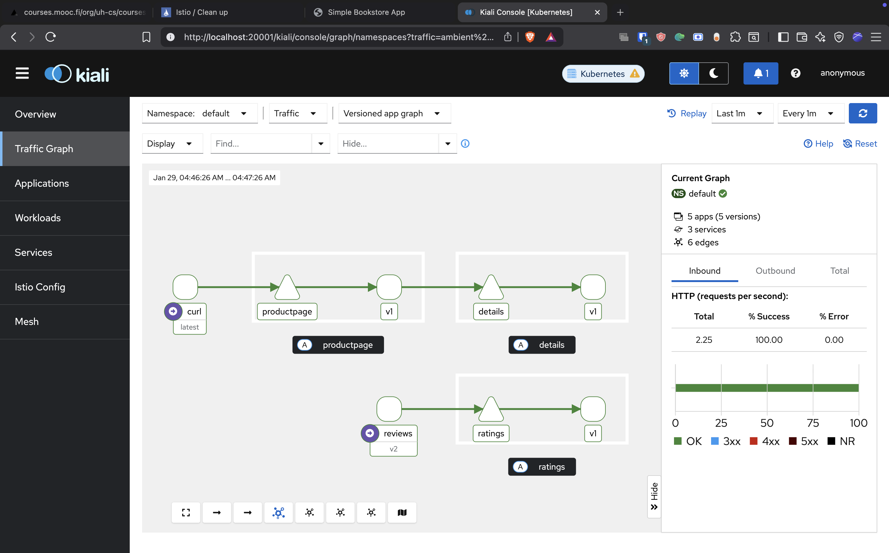
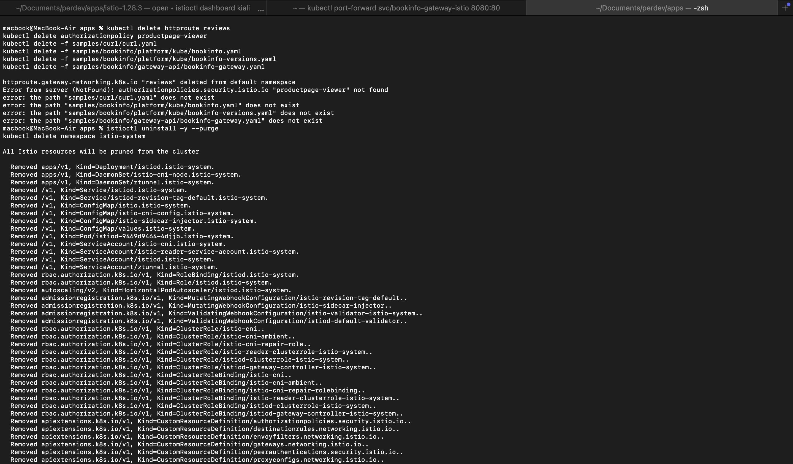

# Exercise 5.2 - Getting Started with Istio Service Mesh

## Setup
- **Platform**: k3d (Traefik disabled)
- **Istio Mode**: Ambient mesh
- **Sample App**: Bookinfo

---

## Evidence

### 1. k3d Cluster Created (no Traefik)

### 2. Istio CLI Installed

### 3. Ambient Mesh Installed

### 4. Bookinfo App Deployed

### 5. Bookinfo Accessible

### 6. Kiali Dashboard

### 7. Kiali Traffic View

### 8. Kiali After Full Config

### 9. Cleanup

