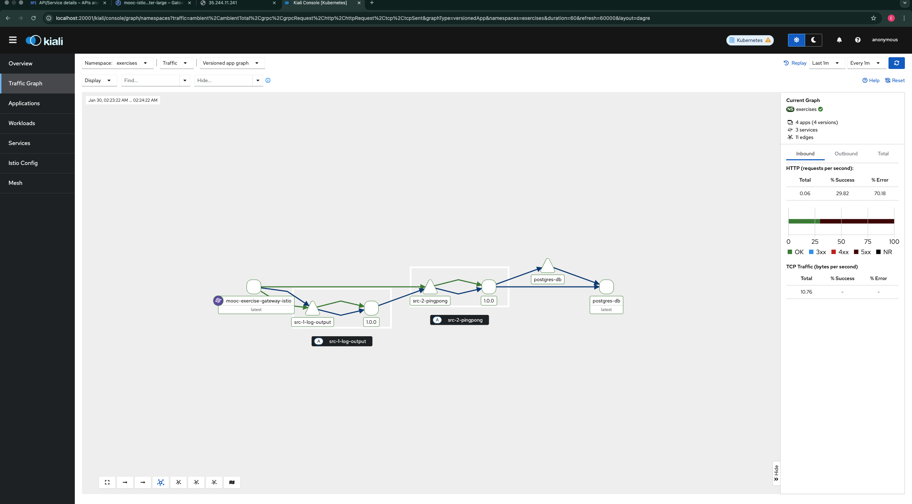
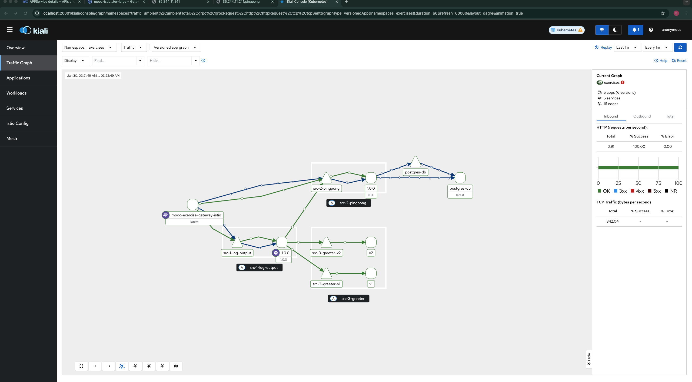

# Exercise 5.3: Log App, The Service Mesh Edition

## Overview
This exercise deploys the Log Output application to a **GKE (Google Kubernetes Engine)** cluster using **Istio Ambient Mesh**.
The goal is to implement a Greeter service (v1/v2) and configure weighted traffic splitting (75% to v1, 25% to v2).

## 1. Setup & Installation

### Create System Resources
Create the namespace and apply resource quotas to ensure GKE stability.
```bash
kubectl create ns istio-system
kubectl apply -f manifests/istio_system_resource_quota.yaml
```

### Install Istio (Ambient Profile)
Install Istio with the `ambient` profile, customized for the GKE environment.
```bash
istioctl install --set profile=ambient \
  --set values.global.platform=gke \
  --set values.pilot.resources.requests.cpu=200m \
  --set values.pilot.resources.requests.memory=256Mi
```

### Install Gateway API & Addons
Install Kubernetes Gateway API (required for Ambient) and observability tools.
```bash
kubectl apply -f https://github.com/kubernetes-sigs/gateway-api/releases/download/v1.2.0/standard-install.yaml
kubectl apply -f https://raw.githubusercontent.com/istio/istio/release-1.28/samples/addons/prometheus.yaml
kubectl apply -f https://raw.githubusercontent.com/istio/istio/release-1.28/samples/addons/kiali.yaml
```

## 2. Application Deployment

### Prepare Namespace
Create the namespace and enable Ambient mode.
```bash
kubectl create ns exercises
kubectl label namespace exercises istio.io/dataplane-mode=ambient
```

### Configure Traffic Split (Waypoint)
Deploy a **Waypoint Proxy** to enable L7 traffic splitting (75% to v1, 25% to v2).
```bash
istioctl waypoint apply -n exercises --enroll-namespace
```

### Apply Manifests
Deploy the application components and routing rules.
```bash
kubectl apply -f manifests/
```

## 3. Verification
Verify the setup using Kiali to visualize traffic flow.

### Access Kiali Dashboard
```bash
kubectl port-forward svc/kiali -n istio-system 20001:20001
```

## Evidence

### 1. Kiali Traffic View (Before Greeter)


### 2. Final Traffic Split (75/25)


