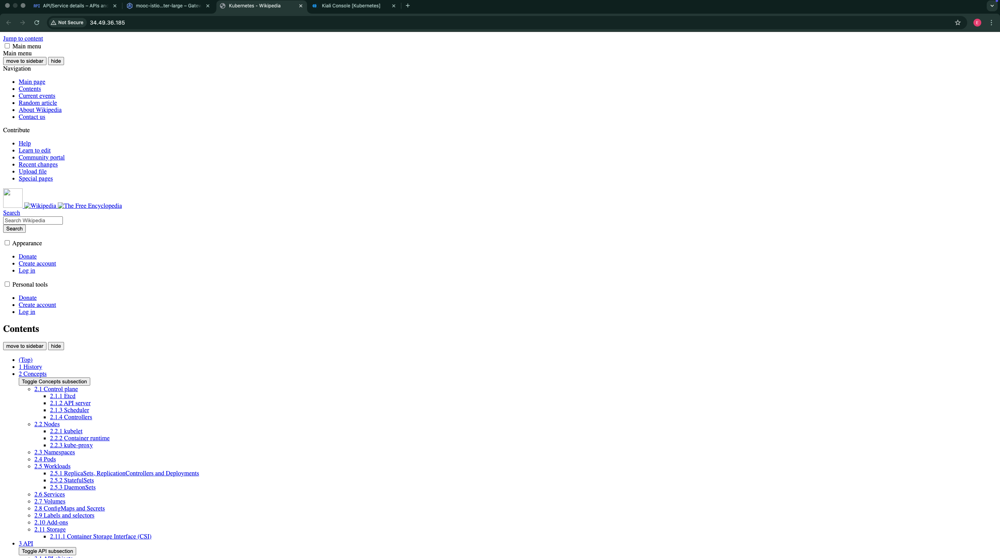
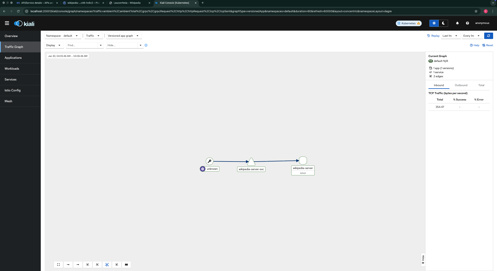

# Exercise 5.4: Wikipedia with Init and Sidecar

## Overview
A single Pod with three containers sharing an `emptyDir` volume to serve Wikipedia content.

### Implementation
- **Init Container**: Installs `curl` and downloads the initial "Kubernetes" Wikipedia page to the shared volume.
- **Main Container**: `nginx:alpine` serving the static HTML from the shared volume.
- **Sidecar Container**: Runs a loop sleeping for 5-15 minutes, then overwrites the content with a random Wikipedia page (`Special:Random`).

## Evidence

### Pod Details

### Ingress Console

### Browser Access via Ingress

### Kiali Traffic View

