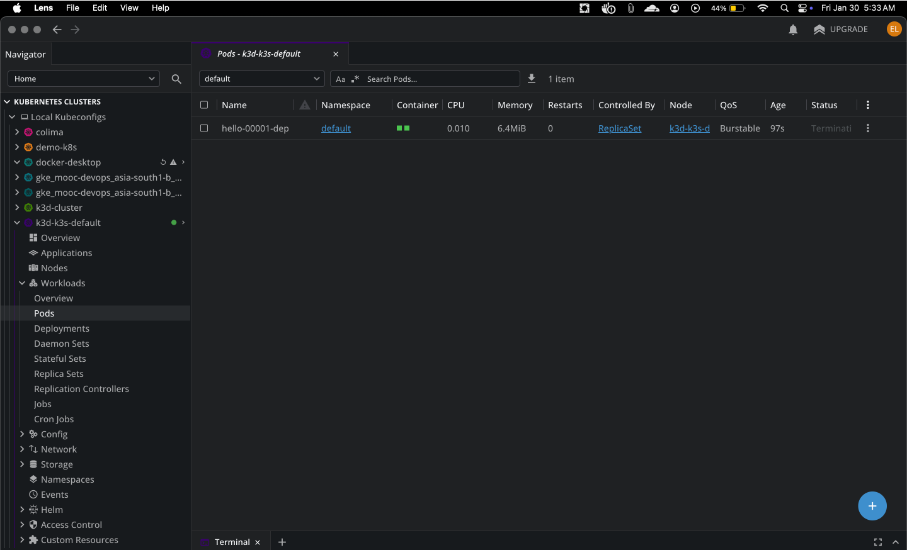
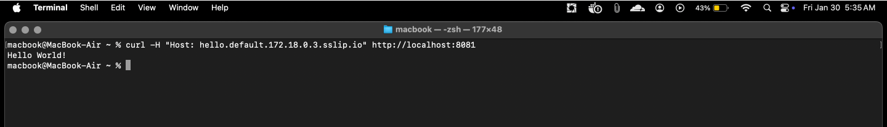
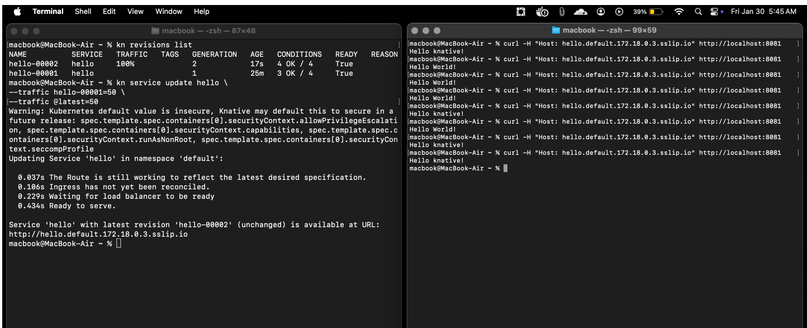
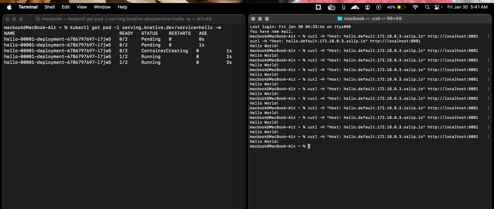

# 5.6 Knative Serverless

My manifests are in the `manifests/` directory.

### Knative Installation & Pods
Running serverless workloads on k3d with Knative serving.

### Accessing the Service
Verifying the service works via `curl` using the `sslip.io` domain.

### Revisions & Traffic Splitting
Demonstrating traffic splitting between two revisions (v1 and v2) and autoscaling behavior.

