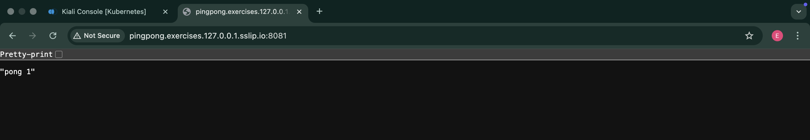
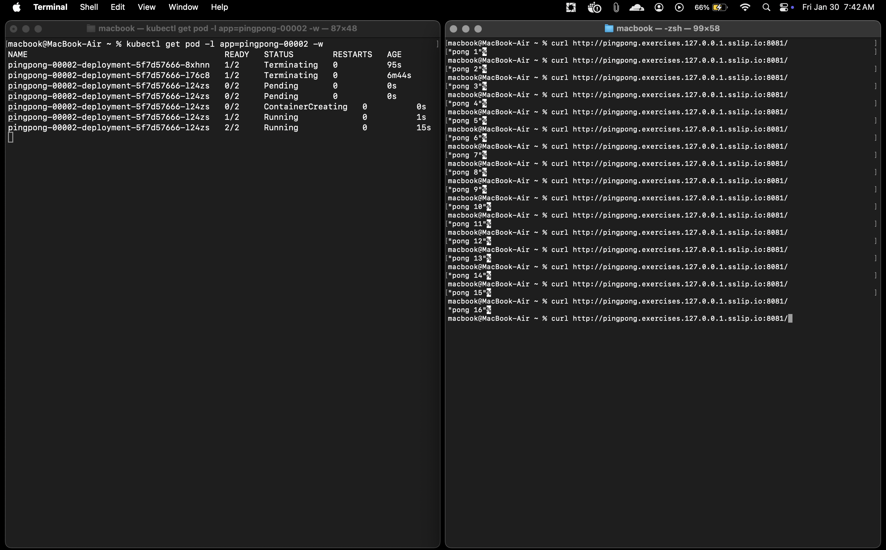
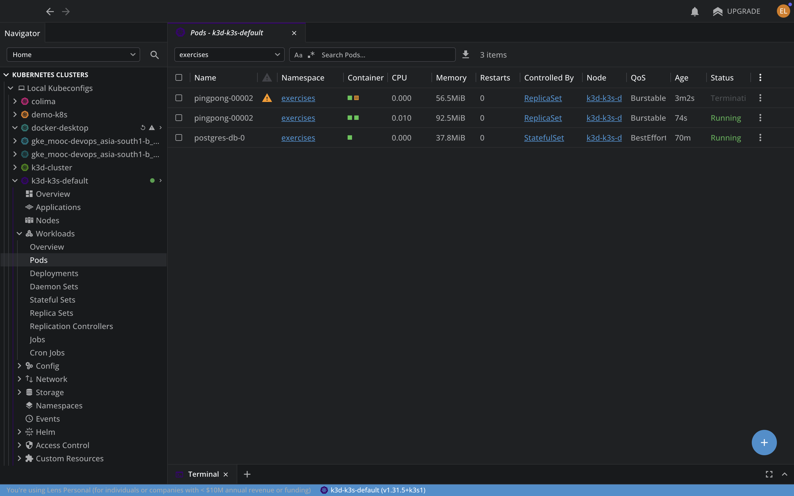

# Exercise 5.7: Deploy to Serverless

In this exercise, the Ping-pong application was migrated to a serverless architecture using Knative.

## Features implemented:
- **Knative Service Deployment:** Moved Ping-pong from a standard Kubernetes Deployment to a Knative Service in `manifests/pingpong.yaml`.
- **Scale to Zero:** Configured the service to scale down to 0 replicas when idle.

## Verification

## Browser Accessibility

To access the service in the browser via `127.0.0.1.sslip.io`, the Knative domain was patched from the default `172.18.0.3.sslip.io`:

```bash
kubectl patch configmap config-domain -n knative-serving --type merge -p '{"data":{"127.0.0.1.sslip.io":"","172.18.0.3.sslip.io":null}}'
```

The service is now accessible at:
[http://pingpong.exercises.127.0.0.1.sslip.io:8081/pings](http://pingpong.exercises.127.0.0.1.sslip.io:8081/pings)

## Evidence

### Browser Access (Pings)


### Browser Access (Ping Pong)


### Terminal: Scale to Zero & Curl Verification


### Resource View (Lens)

